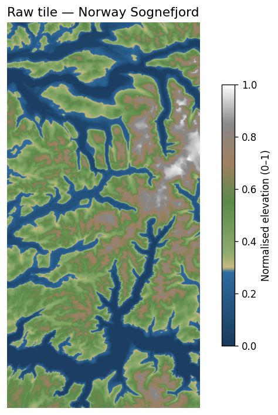
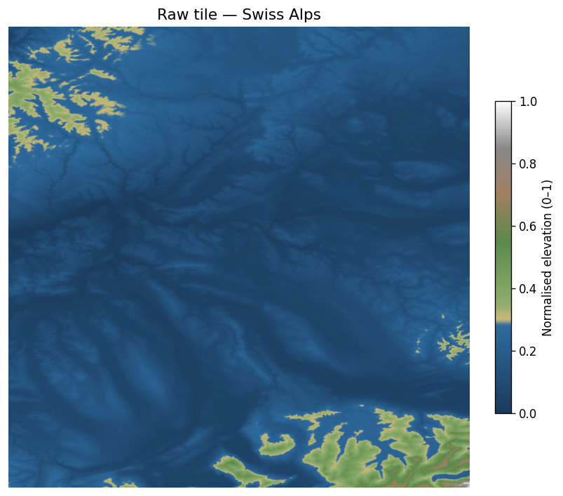
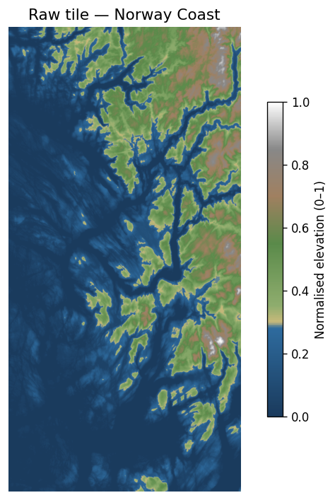
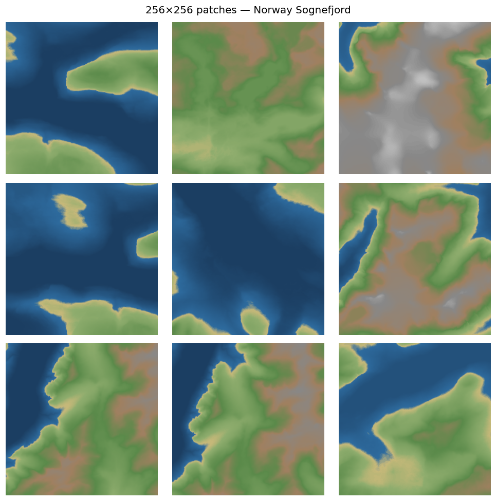
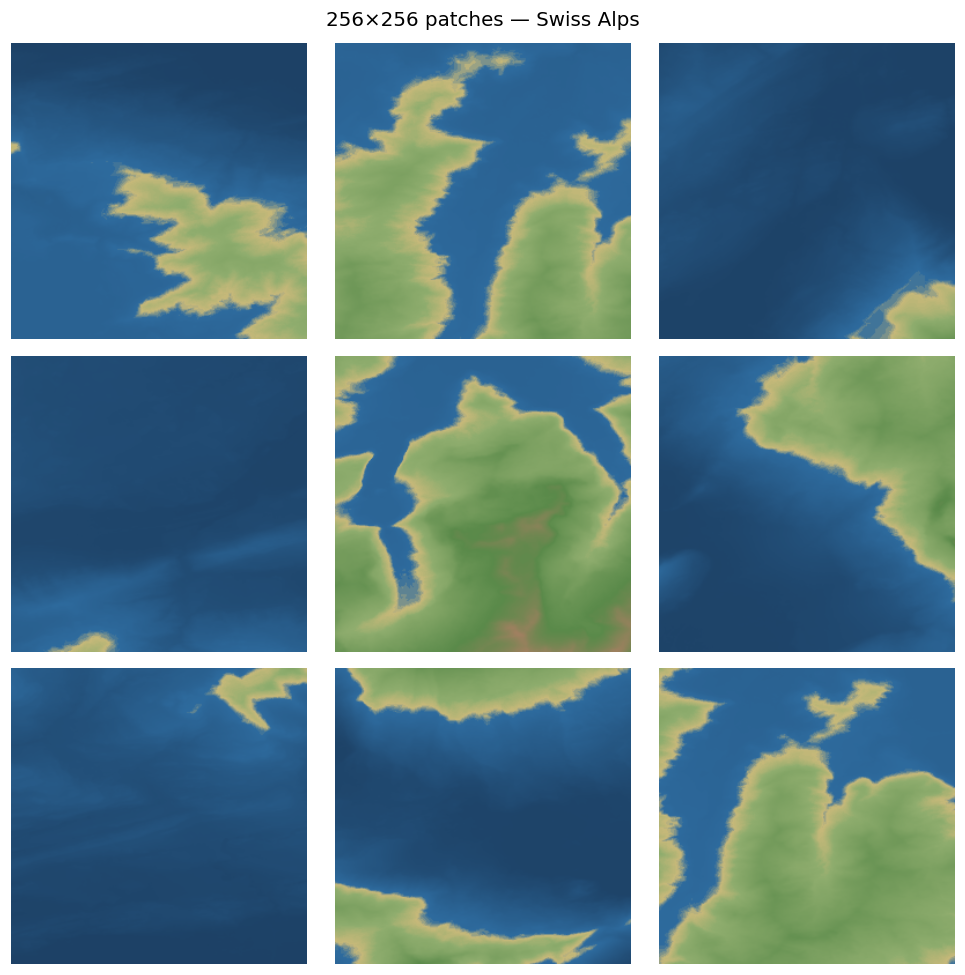
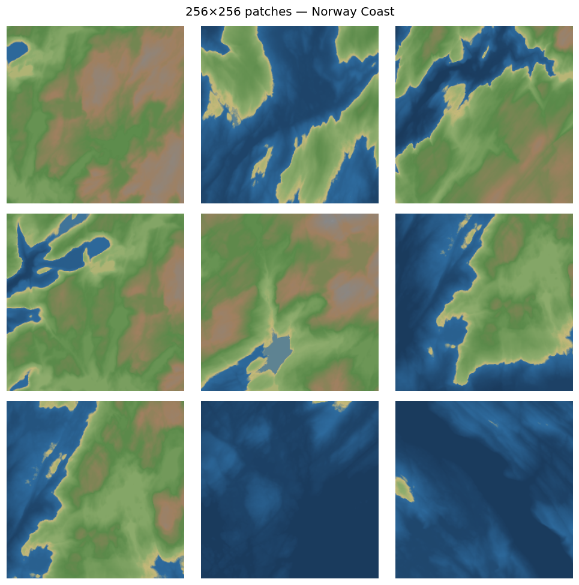
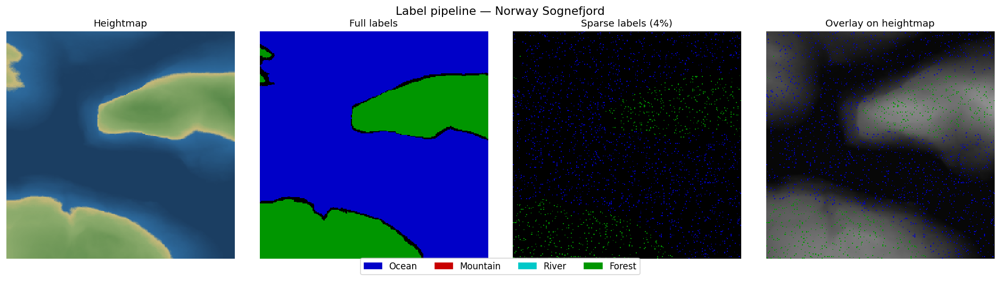
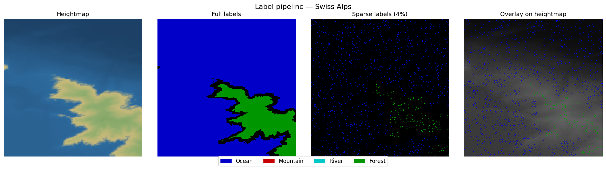
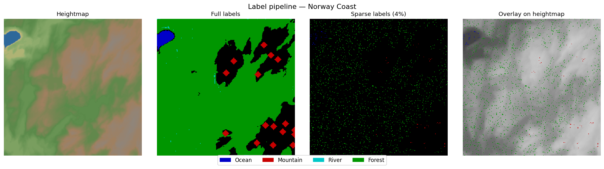

# Dataset Overview

Source: **Copernicus GLO-30** (30 m resolution, free via AWS S3).
Current download: **373 tiles** across Norway, Swiss Alps, and Iceland.

Each tile covers 1°×1° (~111 km × ~80 km at 60°N) at 3600×3600 pixels.
After slicing into 256×256 patches with stride 128 and filtering flat patches (< 200 m relief), we expect ~150k training pairs.

---

## Raw tiles

Full 1°×1° tiles normalized to [0, 1]. Deep blue = ocean / sea level, white = highest peaks.

| Norway — Sognefjord | Swiss Alps | Norway — Coast |
|---|---|---|
|  |  |  |

The Sognefjord tile shows the characteristic fjord signature: sea-level inlets cutting deep into high terrain. The Swiss tile is uniformly high-relief with no ocean. The coastal Norway tile mixes fjord, island, and open sea.

---

## 256×256 patches

Random patches sampled from each tile (min relief threshold 0.25). These are the units the model trains on.

**Norway — Sognefjord**


**Swiss Alps**


**Norway — Coast**


---

## Label derivation pipeline

Each heightmap patch gets an automatically derived label map, then sparsified to ~4% of pixels to simulate user brush strokes.

**Norway — Sognefjord**


**Swiss Alps**


**Norway — Coast**


### Label rules (current)

| Label    | Color  | Rule |
|----------|--------|------|
| Ocean    | Blue   | elevation < 0.30 |
| Mountain | Red    | local maxima > 0.75, dilated 6px |
| River    | Cyan   | pixels below local smoothed surface (proxy — full D8 flow accumulation in preprocessing) |
| Forest   | Green  | non-ocean, non-mountain, 0.32 < elevation < 0.70 |
| Desert   | Yellow | user-painted only (no auto-derivation yet) |

The sparse label panel (4%) is what the model actually receives as input — roughly what a user would paint in 10–20 brush strokes.

---

## Regenerating these images

```bash
uv run python data_pipeline/make_dataset_preview.py
```

To add more showcase tiles, edit the `SHOWCASE_TILES` dict at the top of that script.
