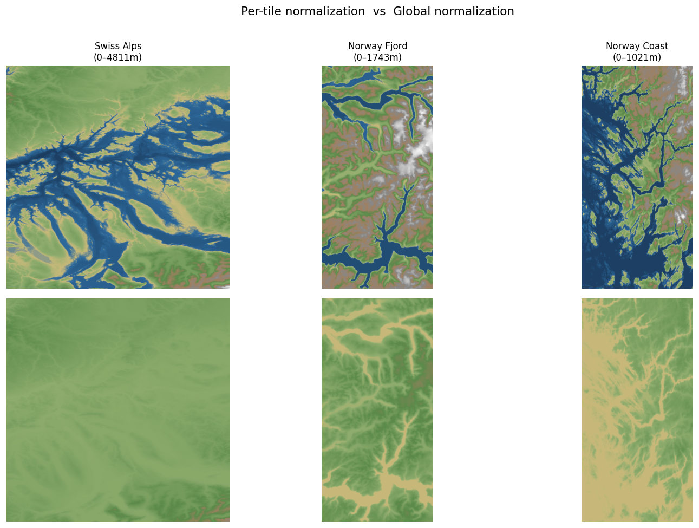

# Dataset Overview

Source: **Copernicus GLO-30** (30 m resolution, free via AWS S3).
Current download: **373 tiles** across Norway, Swiss Alps, and Iceland.

Each tile covers 1°×1° (~111 km × ~80 km at 60°N) at 3600×3600 pixels.
After slicing into 256×256 patches (stride 128) and filtering flat patches (< 200 m relief), we expect ~150k training pairs.

---

## Global normalization

All elevation values are normalized using a **fixed global range** of −500 m to 5000 m, so heights are comparable across all tiles. A Norwegian peak at 1800 m and a Swiss peak at 1800 m map to the same value in the heightmap — the model can learn what "tall" means.

The old per-tile approach (each tile stretched to full [0,1]) made every tile look maximally varied regardless of actual height, breaking this consistency:



With global normalization (bottom row), the Swiss Alps tile correctly appears brighter than the lower Norwegian tiles. The colormap key:

| Color | Elevation |
|---|---|
| Dark blue | −500 m (ocean floor) |
| Mid blue | ≈ 0 m (sea level) |
| Tan | ≈ 100 m (beach / lowland) |
| Green | 100–1600 m (forest zone) |
| Brown | 1600–2500 m (highland) |
| Grey | 2500–4000 m (rock) |
| White | 4000–5000 m (snow / alpine) |

---

## Raw tiles

Full 1°×1° tiles with elevation range displayed in the title.

| Norway — Sognefjord | Swiss Alps | Norway — Coast |
|---|---|---|
|  |  |  |

The Sognefjord tile shows fjord inlets cutting into high terrain. The Swiss tile is uniformly mid-to-high elevation (landlocked, no ocean). The coastal Norway tile mixes fjord, island, and open sea.

---

## 256×256 training patches

Random patches sampled with ≥ 200 m relief. Elevation range (metres) shown per patch.

**Norway — Sognefjord**


**Swiss Alps**


**Norway — Coast**


---

## Label derivation pipeline

Labels are derived from **absolute elevation thresholds**, not relative ones:

| Label    | Color  | Rule |
|----------|--------|------|
| Ocean    | Blue   | elevation < 10 m |
| Mountain | Red    | elevation > 1800 m |
| Forest   | Green  | 100 m < elevation < 1600 m, non-ocean, non-mountain |
| River    | Cyan   | below local smoothed surface by > 5 m (D8 flow accumulation via pysheds) |
| Desert   | Yellow | user-painted only — no auto-derivation yet |

Each patch is then **sparsified to a random 1–20% of pixels** to simulate user brush strokes. The model trains on this sparse input and learns to reconstruct the full heightmap.

**Norway — Sognefjord**


**Swiss Alps**


**Norway — Coast**


---

## Regenerating these images

```bash
uv run python data_pipeline/make_dataset_preview.py
```

To add more showcase tiles, edit `SHOWCASE_TILES` at the top of that script.
The normalization constants (`ELEV_MIN`, `ELEV_MAX`) and label thresholds must be kept in sync with `preprocess.py`.
