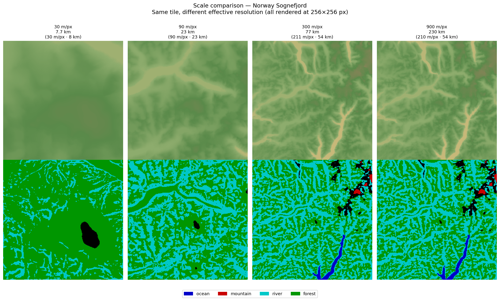
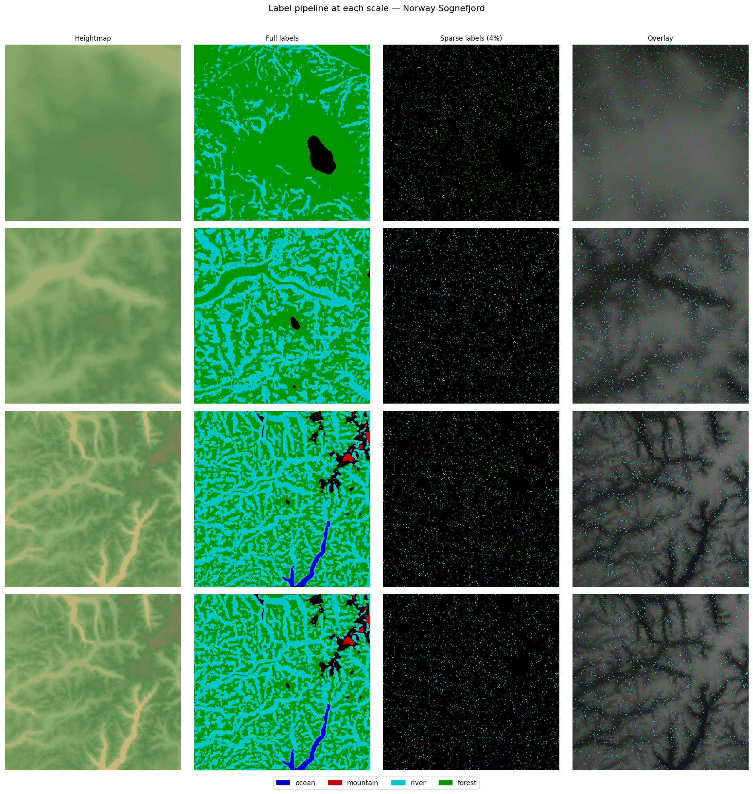
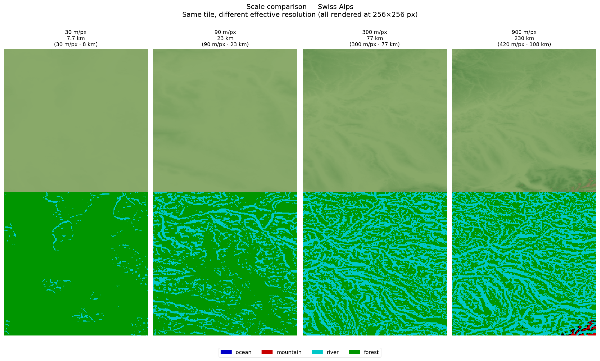
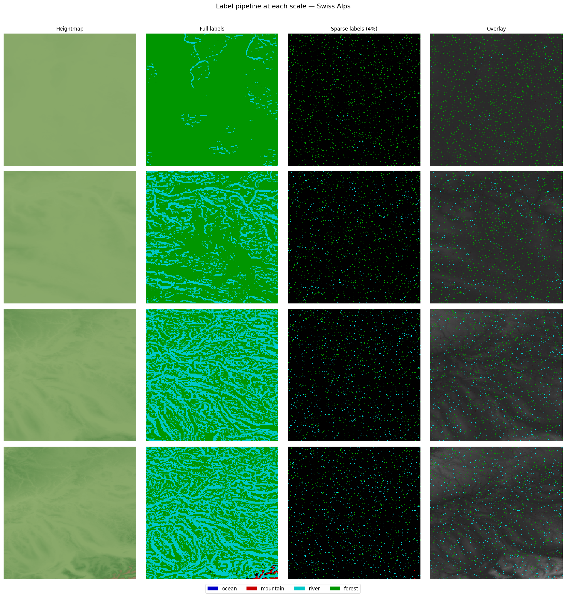
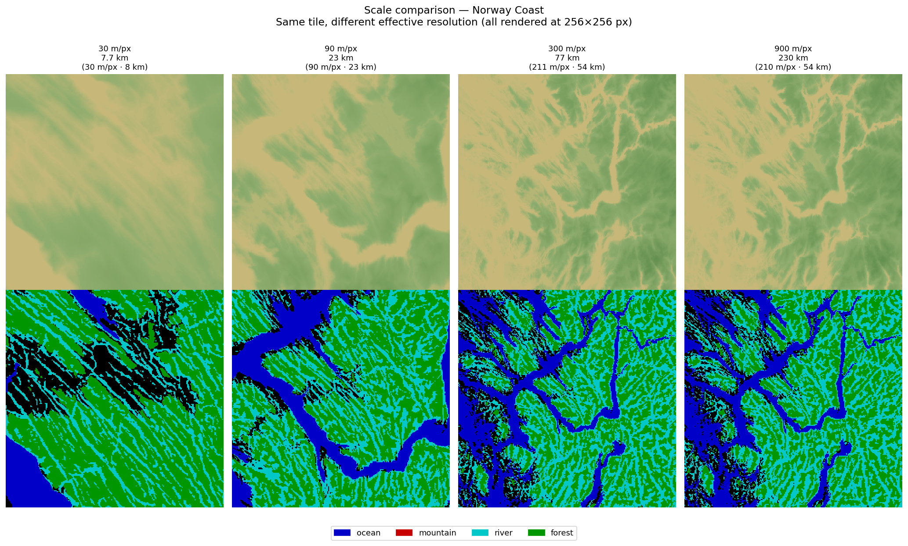
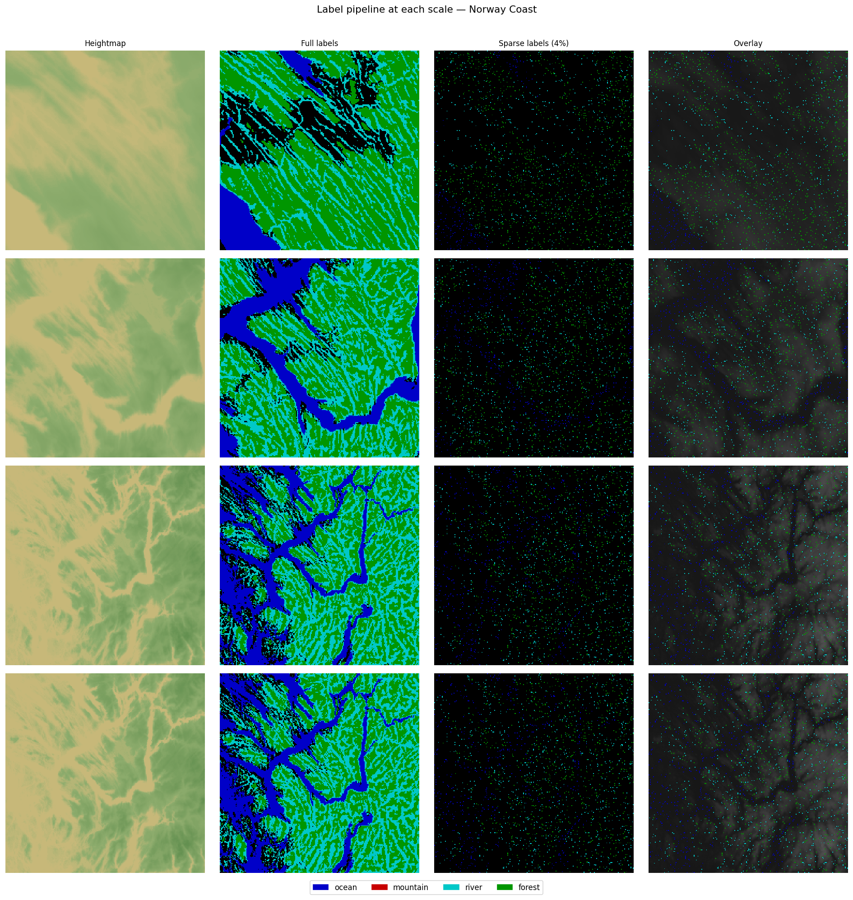

# Scale Comparison: What Resolution Produces the Best Fantasy Maps?

The current pipeline uses **Copernicus GLO-30** at 30 m/pixel. A 256×256 training
patch therefore covers only **7.7 km × 7.7 km** — a single valley or hillside.

For a fantasy world map, the desired coverage is typically a *region* (city → coast,
full mountain range, island group) — roughly **50–250 km** per side. That requires
a coarser effective resolution.

This document shows the same tile centre rendered as a 256×256 patch at four scales
so you can judge which feels right for the target use case.

---

## Coverage at each scale

| Scale | Effective res | Coverage (256 px) | What you see |
|-------|--------------|-------------------|-------------|
| **30 m/px** (current) | 30 m | 7.7 km | Single valley, river bend, cliff face |
| **90 m/px** | 90 m | 23 km | Valley system, small island, fjord inlet |
| **300 m/px** | 300 m | 77 km | Full mountain range, coastal province |
| **900 m/px** | 900 m | 230 km | Subcontinent-scale — Alps + Po Valley |

For a **fantasy region map** (equivalent to a D&D hex map or a LOTR-style region),
**90–300 m/px** is the sweet spot: enough detail for recognisable terrain features
(ridgelines, river valleys, coastlines) while covering a meaningful geographic area.

---

## Norway — Sognefjord

### Heightmap at each scale


### Label pipeline at each scale


---

## Swiss Alps

### Heightmap at each scale


### Label pipeline at each scale


---

## Norway — Coast

### Heightmap at each scale


### Label pipeline at each scale


---

## Implications for the data pipeline

If you switch to a coarser target resolution, only one parameter changes in
`data_pipeline/preprocess.py`: the **crop size extracted per patch** before
saving (the saved `.npy` is always 256×256, but it represents more terrain).

| Decision | Change needed |
|----------|--------------|
| Stay at 30 m/px | Nothing — current pipeline is correct |
| Move to 90 m/px | Extract 768×768 crops, downsample to 256 before saving |
| Move to 300 m/px | Extract 2 560×2 560 crops, downsample to 256 before saving |
| Move to 900 m/px | Stitch multiple tiles; extract ~7 680×7 680, downsample |

Downsampling before training means the model implicitly learns at the coarser
scale — rivers become broader, mountain chains become smoother, and the label
thresholds (ocean < 10 m, mountain > 1800 m) remain valid because they are
applied to the raw elevation data *before* downsampling.

The label-quality trade-off: at 300 m/px, individual river pixels span 300 m
of real terrain, so narrow rivers may disappear. Consider widening the river
dilation kernel proportionally.

---

## Regenerating these images

```bash
uv run python data_pipeline/make_scale_preview.py            # all tiles
uv run python data_pipeline/make_scale_preview.py --tile swiss_alps  # one tile
```
